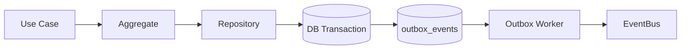

# Outbox Pattern (Event Delivery)

## Exemplo teorico (citacoes do livro)

> "It states that the states will eventually be consistent."
> Fonte: `System-Design-The-big-archive-Alex-Xu-2023.txt`

> "The event store is an append-only log."
> Fonte: `System-Design-The-big-archive-Alex-Xu-2023.txt`

> "event-driven architecture"
> Fonte: `System-Design-The-big-archive-Alex-Xu-2023.txt`

## O que e

Outbox Pattern garante consistencia entre gravacao do agregado e publicacao de eventos.
Em vez de publicar eventos diretamente, gravamos eventos em uma tabela outbox na mesma
transacao do agregado. Um worker posterior le e publica esses eventos, garantindo entrega
at-least-once e evitando estados inconsistentes quando o banco falha no meio do fluxo.

## Por que usamos aqui

- Baseado em eventual consistency (BASE) para sistemas distribuidos.
- Eventos precisam de um log confiavel (append-only) para reprocessamento e resiliencia.
- O sistema segue um estilo event-driven, entao precisamos de entrega confiavel.

## Como foi aplicado no codigo

### 1) Tabela de outbox
- `src/modules/social-care/interface/database/postgres/migrations/002_outbox_events.sql`
- Estrutura basica: id, aggregate_id, aggregate_type, event_name, payload, metadata, status.

### 2) Escrita transacional no save do agregado
- `src/modules/social-care/interface/repositories/postgres-patient.repository.ts`
- `enqueueOutboxEvents` grava eventos do agregado na mesma transacao da persistencia.

### 3) Worker de processamento
- `src/modules/social-care/interface/outbox/postgres-outbox.worker.ts`
- Loteia eventos `PENDING`, marca como `PROCESSING`, publica no EventBus e marca `PROCESSED`.

## Fluxo (alto nivel)

## Garantias e limites atuais

- Garantia: at-least-once delivery (pode haver duplicidade).
- Limite atual: nao ha scheduler definido no codigo; o worker precisa ser executado por um job.
- Recomendacao: consumers devem ser idempotentes.
