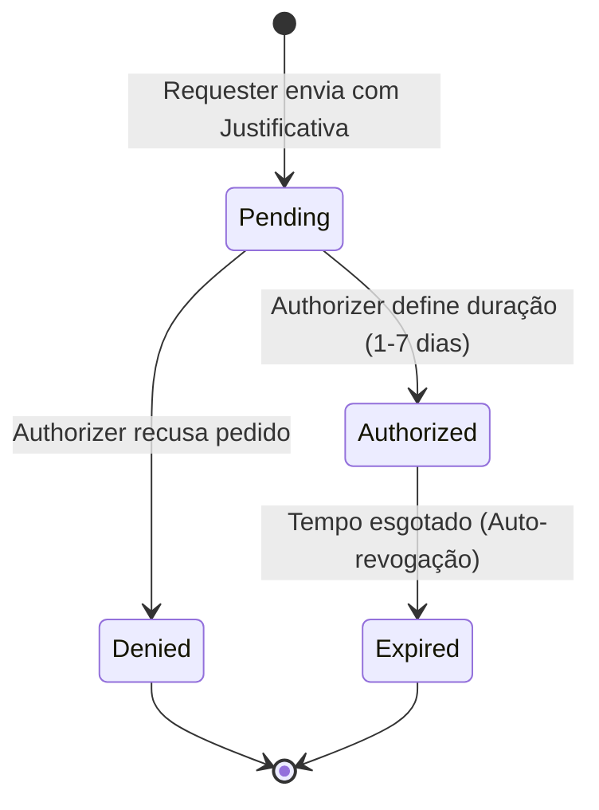

## 1. Agregado Raiz: `Person`

> Representa a **Identidade Única** de um ser humano no ecossistema ACDG. É o "Golden Record" que persiste independentemente do papel que a pessoa desempenha (Visitante, Paciente ou Profissional).

```ts
Person {
  id: PersonID (UUID)
  taxId: CPF (Value Object - Único)
  identityData: {
    legalName: string
    socialName?: string
    birthDate: LocalDate
  }
  roles: Role[] // Coleção de papéis ativos
  status: Active | Inactive | Suspended
  createdAt: Instant
  updatedAt: Instant
}

```

### 1.1 Invariantes e Regras de Negócio

* **Unicidade de Identidade (R1)**: Não podem existir duas instâncias de `Person` com o mesmo `taxId` (CPF). O sistema deve validar a existência antes de qualquer novo registro.
* **Múltiplos Papéis (R2)**: Uma pessoa pode acumular N papéis simultaneamente (ex: uma pessoa pode ser `Admin` e `Lawyer` ao mesmo tempo).
* **Promoção de Papéis (R3)**: O ciclo de vida permite a adição de papéis sem a criação de um novo `PersonID`. Um `Visitor` pode ser "promovido" a `Patient` apenas adicionando o papel correspondente à sua lista de `roles`.
* **Integridade de Dados (R4)**: O `legalName` e `birthDate` devem ser validados contra fontes oficiais (quando possível) para garantir a precisão do registro.

---

## 2. Agregado: `Account` (Segurança/SSO)

> Gerencia as credenciais de acesso único (Single Sign-On). Cada conta está vinculada obrigatoriamente a um `PersonID`.

```ts
Account {
  id: AccountID
  personId: PersonID (FK)
  login: string (CPF ou E-mail)
  passwordHash: string
  mfaSecret?: string
  lastLogin: Instant
  status: Active | Blocked | Expired
}

```

### 2.1 Comportamentos Principais

* **Autenticação Única**: O `passwordHash` é validado centralmente para permitir acesso a qualquer módulo da ACDG (Filas, Jurídico, Terapias, etc.).
* **Bloqueio de Segurança**: A conta pode ser bloqueada por tentativas excessivas de login ou por decisão administrativa no People Context, refletindo instantaneamente em todos os sistemas.

---

## 3. Agregado: `DataAccessRequest` (Broker de Autorização)

> Entidade que orquestra a governança de dados sensíveis entre diferentes `PersonIDs`. Implementa a mediação de confiança entre departamentos.

```ts
DataAccessRequest {
  id: RequestID
  requesterId: PersonID (Quem pede)
  authorizerId: PersonID (Quem autoriza)
  targetPersonId: PersonID (De quem é o dado)
  contextRef: string (Ex: "Prontuário_Social" | "Sessão_Terapia")
  justification: string (Obrigatório)
  status: Pending | Authorized | Denied | Expired
  durationInDays: number (Máximo 7)
  timestamps: { requestedAt, authorizedAt?, expiresAt? }
}

```

### 3.1 Invariantes e Regras de Governança

* **Justificativa Obrigatória (R5)**: Nenhuma solicitação pode ser enviada ou processada sem um texto de justificativa descrevendo o motivo legal ou assistencial do pedido.
* **Temporalidade Estrita (R6)**: O acesso é concedido por um período definido pelo autorizador, com um teto máximo de **7 dias corridos**.
* **Hierarquia de Contingência (R7)**: Na ausência ou impedimento do autorizador primário (ex: Profissional de Férias), um `Admin` ou `Coordinator` do setor pode atuar como `authorizerId`.
* **Aviso de Efemeridade (R8)**: Ao ser autorizado, o sistema deve registrar e exibir o aviso: *"Dado temporário para consulta. Cópia proibida para evitar decisões baseadas em informações desatualizadas"*.
* **Proibição de Autoaprovação (R9)**: Um `PersonID` não pode autorizar sua própria solicitação de acesso (`requesterId != authorizerId`). Tentativas de autoaprovação devem ser bloqueadas e registradas como incidentes de auditoria.

---

## 4. Máquinas de Estado

### 4.1 Ciclo de Vida da Autorização de Dados



---

## 5. Value Objects e Enums

* **Role (Papel)**:
* `Visitor`: Acesso apenas a registros de entrada/saída física.
* `Patient`: Acesso a filas, planos de atendimento e portal do paciente.
* `Professional:<Setor>`: Acesso às ferramentas do setor (ex: `Professional:Therapy`).
* `Admin`: Gestão global de pessoas e permissões.


* **PresenceKey (Chave de Presença)**:
* `deviceId`: Identificador do ESP32.
* `rotatingKey`: Chave dinâmica gerada a cada 5 segundos para validação de entrada.


---

## 6. Regras de Integridade (Invariantes Nucleares)

| # | Regra | Impacto |
| --- | --- | --- |
| **R1** | CPF Único | Impede a criação de registros duplicados no People Context. |
| **R2** | RBAC Aditivo | Permite que uma pessoa acumule funções sem trocar de conta. |
| **R3** | Autorização entre Pares | Garante que o responsável pelo dado seja o guardião da privacidade. |
| **R4** | Expiração Automática | Minimiza o risco de exposição prolongada de dados sensíveis. |
| **R5** | SSO Obrigatório | Garante que a revogação de uma conta desabilite o acesso em todos os módulos da ACDG. |

---